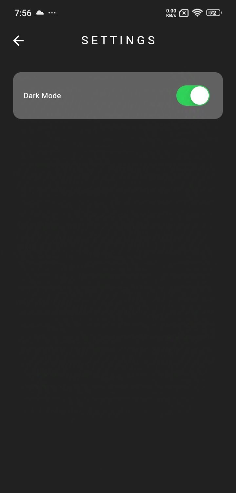
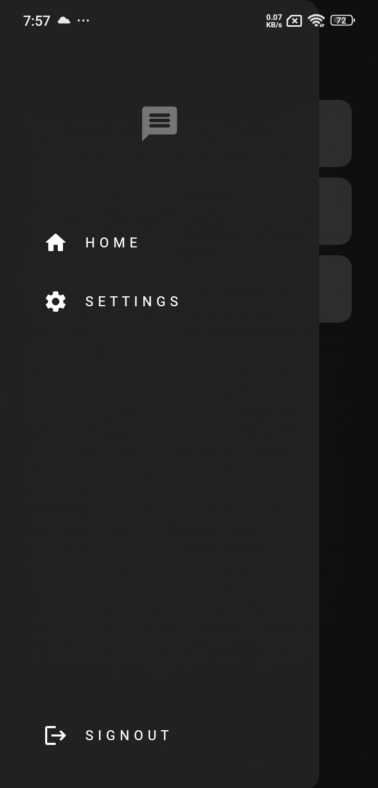
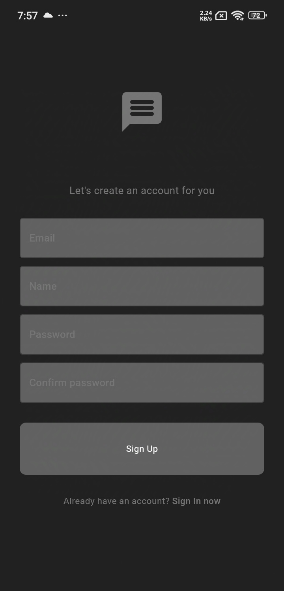
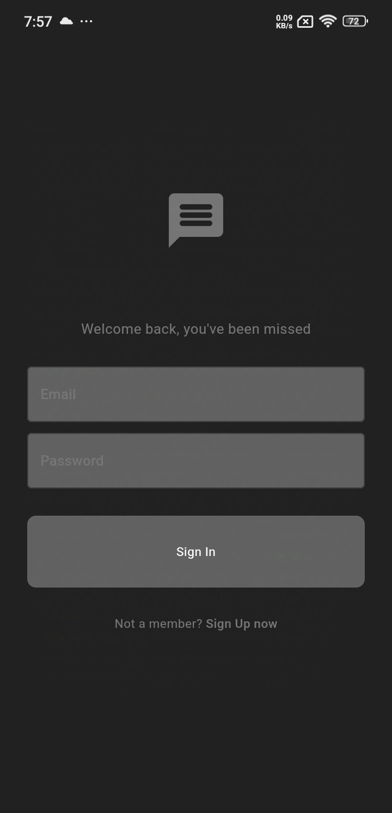

# 📱 Simple Chat App - Flutter Dummy Project

Welcome to the **Simple Chat App**, a mobile application developed as a practice project to learn and implement advanced Flutter development techniques. Inspired by a video tutorial from the YouTuber [MitchKoko](https://www.youtube.com/watch?v=5xU5WH2kEc0&t=3430s&ab_channel=MitchKoko), this app explores real-time chat functionalities using modern tools and clean architecture.

While the design and flow of the app take inspiration from the video, the implementation is distinct, leveraging technologies like **Bloc Cubit**, **Firebase**, and **Freezed**.

## ✨ Features

- **Real-Time Messaging**: Chat with others in real time using Firebase Firestore.
- **User Authentication**: Login and register with Firebase Authentication.
- **User List**: View a list of registered users and initiate chats.

## 🎥 Live Demo

Play the videos simultaneously for a better experience.

https://github.com/user-attachments/assets/5f294bc8-8778-4b7d-a980-ca024bcbfbef

https://github.com/user-attachments/assets/282753e3-e99b-496d-b5c8-ec03444636e1

<!-- <div style="display: flex; flex-wrap: wrap; gap: 10px;">
    <video controls width="300">
    <source src="assets/videos/1.mp4" type="video/mp4">
    Your browser does not support the video tag.
    </video>
    <video controls width="300">
    <source src="assets/videos/2.mp4" type="video/mp4">
    Your browser does not support the video tag.
    </video>
</div> -->

## 📱 Screenshots

<div style="display: flex; flex-wrap: wrap; gap: 10px;">
  
  
  
  
</div>

## 🛠 Tech Stack

- **Framework**: [Flutter](https://flutter.dev/)
- **State Management**: [Bloc Cubit](https://pub.dev/packages/flutter_bloc)
- **Backend**: [Firebase Authentication & Firestore](https://firebase.google.com/)
- **Code Generation**: [Freezed](https://pub.dev/packages/freezed)
- **Architecture**: Clean Architecture

## 🚀 Installation Guide

Follow these steps to run the project locally:

### Prerequisites

- Flutter SDK ([Installation Guide](https://flutter.dev/docs/get-started/install))
- Android Studio / VSCode
- Firebase Project Setup ([Guide](https://firebase.google.com/docs/flutter/setup))

### Steps

1. **Clone the Repository**
   ```bash
   git clone https://github.com/FatwahFir/simple-chat-app.git
   cd simple-chat-app
   ```

2. **Install Dependencies**
   ```bash
   flutter pub get
   ```

3. **Generate Code with Freezed**
   ```bash
   dart run build_runner build --delete-conflicting-outputs
   ```

4. **Set Up Firebase**
   - Download the `google-services.json` file for Android.
   - Download the `GoogleService-Info.plist` file for iOS.
   - Place these files in their respective project directories.

5. **Run the Application**
   ```bash
   flutter run
   ```

6. **Build for Android/iOS**
   - Android: `flutter build apk`
   - iOS: `flutter build ios` (macOS required)

## 🧑‍💻 Folder Structure (Clean Architecture)

The project follows the **Clean Architecture** approach, ensuring separation of concerns and scalability:

```
lib/
|-- core/                  # Common resources (constants, themes)
|-- features/
|   |-- chat/              # Chat feature
|       |-- data/          # Data sources and models
|       |-- domain/        # Business logic and entities
|       |-- presentation/  # UI and widgets
|   |-- auth/              # Authentication feature
|       |-- data/
|       |-- domain/
|       |-- presentation/
|-- main.dart              # Entry point
```

### Explanation

- **Core**: Houses shared resources like themes and constants.
- **Features**: Each app feature is broken into `data`, `domain`, and `presentation` layers.
  - **Data**: Handles API or database interactions.
  - **Domain**: Contains business logic and entities.
  - **Presentation**: Widgets, screens, and state management.

## 💻 Contributors

- **Fatwah Firmansyah SR** - [GitHub](https://github.com/FatwahFir)

Feel free to open an issue or reach out on GitHub for any questions or feedback!

## 📄 License

This project is licensed under the MIT License. You are free to use, modify, and distribute the code as per the terms of the license.